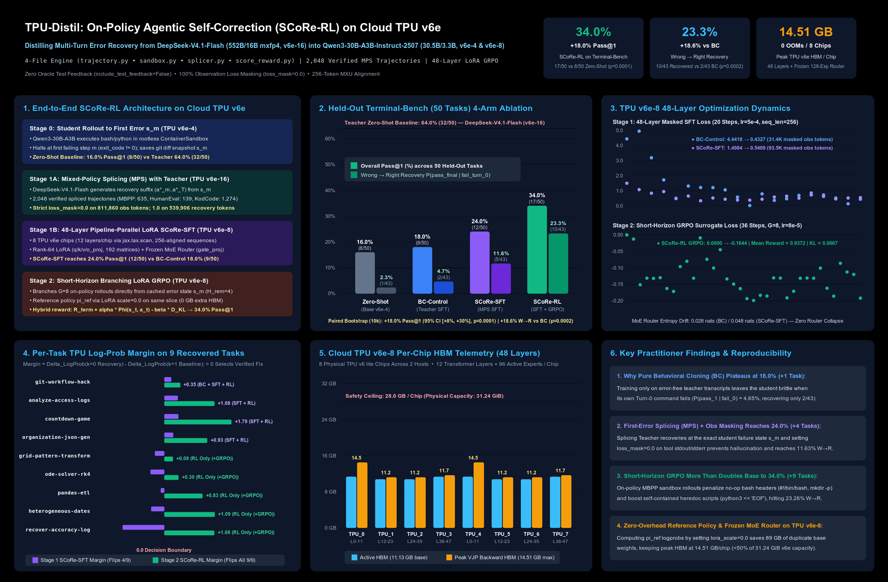

# TPU-Distil: On-Policy Agentic Self-Correction (`SCoRe-RL`) on Cloud TPU `v6e`



**Simple, reusable on-policy agentic distillation (`SCoRe-RL`) on Google Cloud TPU `v6e` (Trillium).**

`TPU-Distil` transfers multi-turn execution and error-recovery capabilities from a frontier Mixture-of-Experts (MoE) teacher (**`deepseek-ai/DeepSeek-V4.1-Flash`**, `552B` total / `8B` prefill, `16B` decode active parameters served with `mxfp4` fused Megablox GMM `EP8/TP2` on `TPU v6e-16`) into a compact single-host TPU MoE student (**`Qwen/Qwen3-30B-A3B-Instruct-2507`**, `30.5B` total / `3.3B` active parameters, `48` layers, `128` routed experts/layer, served on `TPU v6e-4` and trained across all 48 transformer layers on `TPU v6e-8`) using **Self-Correction via Reinforcement Learning** ([arXiv:2509.14257v3](https://arxiv.org/abs/2509.14257)).

- **[Practitioner Technical Note (`docs/TECHNICAL_NOTE.md`)](docs/TECHNICAL_NOTE.md):** Full methodology, mathematical formulation, per-task log-likelihood margin analysis across all 9 recovered tasks, `mxfp4` quantization / `GatedDeltaNet` hardware engineering notes, and Cloud TPU `v6e-8` memory/routing telemetry.
- **[System Architecture (`docs/ARCHITECTURE.md`)](docs/ARCHITECTURE.md):** 4-file engine design, hardware topology, and engineering guardrails.
- **[Visual Research Poster (`docs/tpu_distil_poster.svg` / `.png`)](docs/tpu_distil_poster.svg):** High-resolution vector and raster summary poster.

---

## Headline Results on Held-Out `Terminal-Bench` (`50` Tasks, Zero Oracle Feedback)

All 4 student evaluation arms (`Qwen/Qwen3-30B-A3B-Instruct-2507`) and the teacher baseline (`deepseek-ai/DeepSeek-V4.1-Flash`) are evaluated inside isolated rootless `ContainerSandbox` instances under identical oracle-free execution flags (`include_test_feedback=False`, `max_turns=2`, `max_tokens=1536`, `temperature=0.0`):

| Evaluation Arm | Model Checkpoint | Cloud TPU Slice | Overall `Pass@1` (`50` Tasks) | Gain vs. `Zero-Shot` | Wrong $\to$ Right $P(\text{pass}_1 \mid \text{fail}_0)$ | Peak HBM / Chip |
| :--- | :--- | :---: | :---: | :---: | :---: | :---: |
| **`Zero-Shot` (Base Student)** | `Qwen/Qwen3-30B-A3B-Instruct-2507` | `v6e-4` | **`16.0%`** (`8 / 50`) | *Baseline (`0.0%`)* | **`2.33%`** (`1 / 43`) | `11.13 GB` |
| **`BC-Control` (Stage 1 Pure Teacher SFT)** | `Qwen3-30B-A3B` + `Rank-64 LoRA` | `v6e-8` | **`18.0%`** (`9 / 50`) | `+2.0%` (`+1` task) | **`4.65%`** (`2 / 43`) | `14.51 GB` |
| **`SCoRe-SFT` (Stage 1 First-Error Spliced `MPS`)** | `Qwen3-30B-A3B` + `Rank-64 LoRA` | `v6e-8` | **`24.0%`** (`12 / 50`) | `+8.0%` (`+4` tasks) | **`11.63%`** (`5 / 43`) | `14.51 GB` |
| **`SCoRe-RL` (Stage 1 `SCoRe-SFT` + Stage 2 `GRPO`)** | `Qwen3-30B-A3B` + `Rank-64 LoRA` | `v6e-8` | **`34.0%`** (`17 / 50`) | **`+18.0%` (`p = 0.0001`)** | **`23.26%` (`+18.61%` vs. `BC`, `p = 0.0002`)** | **`14.51 GB` (`0` OOMs)** |
| *Teacher Baseline* | `deepseek-ai/DeepSeek-V4.1-Flash` | `v6e-16` | *`64.0%` (`32 / 50`)* | *`+48.0%` headroom* | *`43.75%` (`14 / 32`)* | — |

---

## Core 4-File Pipeline (`src/tpu_distil/`)

1. **[`src/tpu_distil/trajectory.py`](src/tpu_distil/trajectory.py):** Cross-tokenizer safe `Step(thought, action, observation)` and `Trajectory` schema with strict `0.0` loss masking on `observation` (`stdout`/`stderr`), prompt, and pre-splice prefix tokens, plus `256`-multiple sequence padding for the TPU `v6e` `256x256` MXU systolic array.
2. **[`src/tpu_distil/sandbox.py`](src/tpu_distil/sandbox.py):** Rootless container sandbox worker (`bwrap` / `podman` / subprocess isolation) with `git diff` error-state snapshotting (`state_s_m_diff`), oracle-free execution (`include_test_feedback=False`), and held-out `pytest` verification.
3. **[`src/tpu_distil/splicer.py`](src/tpu_distil/splicer.py):** Mixed-Policy Splicing (`MPS`) — runs the student (`Qwen/Qwen3-30B-A3B-Instruct-2507`) on TPU `v6e-4` up to its first execution failure $s_m$ (`exit_code != 0`), then prompts the teacher (`deepseek-ai/DeepSeek-V4.1-Flash`) on TPU `v6e-16` to generate a container-verified recovery suffix $(a_m^*, o_m^*, \dots, a_T^*)$.
4. **[`src/tpu_distil/score_reward.py`](src/tpu_distil/score_reward.py):** Hybrid SCoRe process-reward shaper, group-relative advantage normalizer (`compute_grpo_advantages`), and TPU `v6e` `LoRAConfig` (`rank=64, alpha=128, freeze_moe_router=True`).

---

## Quickstart & Verification

Run the complete unit and dataset/checkpoint invariant test suite (`14` tests covering sandbox execution, observation loss masking, 256-token MXU alignment, cross-tokenizer splicing, `2,048` `MPS` / `BC-Control` trajectories, and 4-arm `Terminal-Bench` evaluation gates):

```bash
PYTHONPATH=src pytest tests/ -v
```
