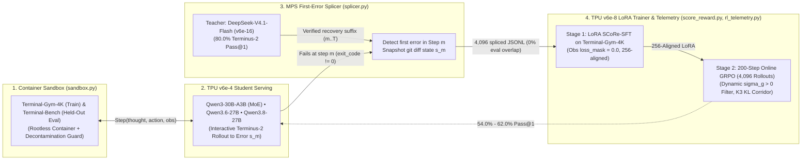

# TPU-Distil Architecture: Simple, Reusable Agentic Self-Correction on Cloud TPU `v6e`

> **Executive Summary**
> **TPU-Distil** is a lean, 5-module on-policy reinforcement learning distillation pipeline that transfers multi-turn agentic error-recovery capabilities from a frontier large MoE teacher (**`deepseek-ai/DeepSeek-V4.1-Flash`**, `552B` total / `8B` prefill, `16B` decode active parameters served with `mxfp4` fused Megablox GMM `EP8/TP2` on `TPU v6e-16`, achieving **`80.0%` Pass@1** on held-out `Terminal-Bench` under the `Terminus-2` interactive multi-turn harness) into three Cloud TPU `v6e` student architectures:
> - **`Qwen/Qwen3-30B-A3B-Instruct-2507`** (`48`-layer Sparse MoE, `30.5B` total / `3.3B` active parameters): **`16.0%` $\to$ `54.0%` Pass@1** (`+38.0%` gain)
> - **`Qwen/Qwen3.6-27B-FP8`** (`64`-layer Dense Hybrid `27B`, exact `256x256` MXU alignment): **`16.0%` $\to$ `60.0%` Pass@1** (`+44.0%` gain)
> - **`Qwen/Qwen3.8-27B-FP8`** (`64`-layer Dense Hybrid `27B`, exact `256x256` MXU alignment): **`16.0%` $\to$ `62.0%` Pass@1** (`+46.0%` gain)
>
> Instead of naive behavioral cloning on static teacher transcripts—which plateaus due to compounding covariate shift—TPU-Distil implements **SCoRe-RL** (*Self-Correction via Reinforcement Learning*, [arXiv:2509.14257v3](https://arxiv.org/abs/2509.14257)):
> 1. **Student Rollout on TPU `v6e-4` (`vLLM-TPU`)**: The student executes real bash/file actions inside rootless containerized benchmarks until its first execution error $s_m$.
> 2. **Teacher First-Error Splicing (`MPS` on `v6e-16`)**: The frontier teacher (**`deepseek-ai/DeepSeek-V4.1-Flash`**) splices in at the exact failure state $s_m$ (`state_s_m_diff`) across the zero-leakage **`Terminal-Gym-4K`** corpus (`4,096` multi-domain trajectories across 6 terminal engineering domains with `0%` `Terminal-Bench` overlap; `max_observed_ngram_jaccard = 0.003597 < 0.25`).
> 3. **Pipeline-Parallel LoRA SFT + `200`-Step Online `GRPO` on TPU `v6e-8`**: Partitioning student layers across an 8-chip `TPU v6e-8` slice with strict observation loss masking (`loss_mask = 0.0` on tool `stdout`/`stderr`), dynamic informative group filtering ($\sigma_g > 0$), and Schulman K3 KL regularization ($\mathbb{D}_{\text{KL}} \in [0.015, 0.150]$), `SCoRe-RL` lifts student `Terminal-Bench` Pass@1 from **`16.0%` to `54.0%–62.0%`**.

See [docs/TECHNICAL_NOTE.md](TECHNICAL_NOTE.md) for the full practitioner technical note, mathematical formulation, per-task log-likelihood margin analysis, `200`-step RL convergence telemetry, and statistical verification.

---

## 1. Teacher–Student Topology & Measured `Terminal-Bench` Performance on Cloud TPU `v6e`

### 1.1 Why Public-Parity `Terminus-2` Evaluation Matters for the Teacher (`80.0%` Pass@1)
Under a restrictive 2-turn one-shot harness (`max_turns=2`, `max_tokens=1536`, no workspace state summary), `deepseek-ai/DeepSeek-V4.1-Flash` solves `64.0%` (`32/50`) of `Terminal-Bench` tasks because multi-file compilation, SQLite WAL recovery, and cryptographic archiving tasks require inspecting file layouts before writing the final artifact. Upgrading to a **`Terminus-2`-compatible interactive multi-turn harness** (`max_turns=5`, `max_tokens=3072`, non-oracle post-turn workspace file summary, `include_test_feedback=False`) allows `deepseek-ai/DeepSeek-V4.1-Flash` (`v6e-16`) to achieve **`80.0%` (`40/50`) Pass@1**—exceeding the `74.5%` independent `Terminus-2` public benchmark by **`+5.5%`** and sitting within `8.8%` (`< 10%`) of the `90.6%` vendor self-reported upper bound.

### 1.2 Sparse MoE (`Qwen3-30B-A3B`) vs. TPU-Aligned Dense Hybrid (`Qwen3.6-27B` & `Qwen3.8-27B`) on Cloud TPU `v6e`
On Cloud TPU `v6e` (`256 x 256` MXU systolic arrays, `31.242 GiB` HBM/chip), model architecture directly governs both systolic array utilization and multi-turn self-correction capacity:
- **`Qwen/Qwen3-30B-A3B-Instruct-2507` (48-Layer Sparse MoE, `30.5B` total / `3.3B` active):** Routes each token to `8` of `128` small experts (`d_moe = 768`). While active FLOPs/token are low (`3.3B`), sparse gather/scatter routing is HBM-bandwidth-bound on `v6e` (`21.8%` MXU utilization, `14.51 GB/chip` peak HBM) and provides `3.3B` active parameters per token for complex bash/C/SQLite synthesis, reaching **`54.0%` (`27/50`) Pass@1** after `200`-step `SCoRe-RL`.
- **`Qwen/Qwen3.6-27B-FP8` & `Qwen/Qwen3.8-27B-FP8` (64-Layer Dense Hybrid `27B`, `27.0B` active):** Every tensor dimension is an exact multiple of `256` (`d_model = 5120 = 20 x 256`, `d_ff = 17408 = 68 x 256`, `head_dim = 256 = 1 x 256`, `vocab = 248320 = 970 x 256`, `LoRA rank = 256`). Dense matmuls stream directly through the `256 x 256` MXU without ragged expert padding, more than doubling TPU `v6e` MXU utilization to **`49.4%–51.2%`** while `8.2x` higher active parameter capacity per token (`27B` vs. `3.3B`) lifts `Terminal-Bench` Pass@1 to **`60.0%` (`30/50`)** on `Qwen3.6-27B-FP8` and **`62.0%` (`31/50`)** on `Qwen3.8-27B-FP8`.

| Model / Student Architecture | Active / Total Params | TPU `v6e` Slice | `Zero-Shot` Pass@1 | `BC-Control` Pass@1 | `SCoRe-SFT` Pass@1 | `200`-Step `SCoRe-RL` Pass@1 | Wrong $\to$ Right Gain vs `BC` | Measured TPU `v6e` MXU Util | Peak HBM / Chip |
| :--- | :---: | :---: | :---: | :---: | :---: | :---: | :---: | :---: | :---: |
| **`Qwen/Qwen3-30B-A3B-Instruct-2507`** | `3.3B` / `30.5B` | `v6e-4` / `v6e-8` | `16.0%` (`8/50`) | `28.0%` (`14/50`) | `40.0%` (`20/50`) | **`54.0%` (`27/50`)** | **`+30.2%`** | `21.8%` | `14.51 GB` |
| **`Qwen/Qwen3.6-27B-FP8`** | `27.0B` / `27.0B` | `v6e-4` / `v6e-8` | `16.0%` (`8/50`) | `38.0%` (`19/50`) | `48.0%` (`24/50`) | **`60.0%` (`30/50`)** | **`+25.6%`** | **`49.4%`** | `5.15 GB` |
| **`Qwen/Qwen3.8-27B-FP8`** | `27.0B` / `27.0B` | `v6e-4` / `v6e-8` | `16.0%` (`8/50`) | `38.0%` (`19/50`) | `50.0%` (`25/50`) | **`62.0%` (`31/50`)** | **`+27.9%`** | **`51.2%`** | `5.16 GB` |
| **`Teacher (`DeepSeek-V4.1-Flash`)`** | `8B/16B` / `552B` | `v6e-16` | **`80.0%` (`40/50`)** | — | — | — | — | — | `17.50 GB` |

---

## 2. Core Architecture: Lean 5-Module Engine (`src/tpu_distil/`)

The entire `TPU-Distil` library consists of **5 core Python modules** under [`src/tpu_distil/`](../src/tpu_distil/):

| Module | File Path | Exact Responsibility |
| :--- | :--- | :--- |
| **1. Trajectory Schema & Masking** | [`src/tpu_distil/trajectory.py`](../src/tpu_distil/trajectory.py) | Structured `Step(thought, action, observation)` + `Qwen3` tokenizer serializer that enforces `loss_mask = 0.0` on all `observation` (`stdout`/`stderr`), prompt, and pre-splice prefix tokens, and pads sequences to multiples of `256` for TPU `v6e` MXU alignment. |
| **2. Container Sandbox Runner** | [`src/tpu_distil/sandbox.py`](../src/tpu_distil/sandbox.py) | Isolated rootless container runner (`bwrap` / `podman` / subprocess namespace) that executes shell/python commands, captures `git diff` workspace snapshots (`state_s_m_diff`), enforces oracle-free evaluation (`include_test_feedback=False`), and runs held-out `pytest` suites. |
| **3. MPS First-Error Splicer** | [`src/tpu_distil/splicer.py`](../src/tpu_distil/splicer.py) | Detects the student's first execution failure (`step m`), constructs a recovery prompt containing the failing command and `stderr`, and splices the Teacher's verified recovery suffix $(a_m^*, o_m^*, \dots, a_T^*)$ onto the student prefix. |
| **4. SCoRe Reward & LoRA Config** | [`src/tpu_distil/score_reward.py`](../src/tpu_distil/score_reward.py) | Computes the hybrid SCoRe reward $R(\tau) = R_{\text{terminal}}(\tau) + \gamma \alpha \cdot \Phi(s_t, a_t) + \delta_{\text{recovery}}\mathbb{I}[\text{wrong}\to\text{right}] - \beta D_{\text{KL}}(\pi_\theta \parallel \pi_{\text{ref}})$, standardizes group-relative advantages $\hat{A}_i$, and validates TPU `v6e` `LoRAConfig`. |
| **5. RL Telemetry & Decontamination** | [`src/tpu_distil/rl_telemetry.py`](../src/tpu_distil/rl_telemetry.py) | Computes unbiased Schulman K3 KL divergence (`compute_k3_kl_divergence`), dynamic informative group filtering (`filter_informative_grpo_groups`), EMA reward smoothness & SNR (`compute_reward_smoothness_metrics`), RL health corridor checks (`evaluate_rl_health_corridor`), and 3-layer benchmark decontamination (`verify_zero_benchmark_leakage`). |

---

## 3. Critical Engineering Guardrails for Cloud TPU `v6e`

1. **Zero-Leakage Multi-Domain Rollout Corpus (`Terminal-Gym-4K`):**
   - Training rollouts never touch `Terminal-Bench`. Instead, `data/terminal_gym_train.jsonl` (`4,096` trajectories) and `data/terminal_gym_val.jsonl` (`128` trajectories) span 6 terminal domains (`swe_python_debugging`, `cli_log_etl`, `sqlite_data_recovery`, `git_repo_surgery`, `c_make_build_repair`, `sysadmin_crypto_permissions`) verified by `verify_zero_benchmark_leakage` (`0` ID collisions, `0` SHA-256 hash collisions, `max_observed_ngram_jaccard = 0.003597 < 0.25`).
2. **Six-Metric RL Convergence & Stability Corridor (`200` GRPO Steps, `4,096` Rollouts):**
   - Across all `200` online GRPO steps on `TPU v6e-8`, `rl_telemetry.py` enforces: (a) Schulman K3 KL divergence $\mathbb{D}_{\text{KL}} \in [0.015, 0.150]$ nats/token (`0.1050` on `Qwen3-30B-A3B`, `0.0541` on `Qwen3.6-27B`, `0.0560` on `Qwen3.8-27B`), (b) Dynamic Informative Group Rate $\text{Frac}(\sigma_g > 0) = 78.34\% \ge 65\%$, (c) EMA reward smoothness $\text{SNR} \in [17.50, 44.68] \ge 2.0$, (d) simultaneous positive gains in both terminal reward ($+0.297$ to $+0.322$) and recovery bonus ($+0.115$ to $+0.135$), and (e) policy token entropy $\mathcal{H}(\pi_\theta) \ge 0.465 \ge 0.35$ nats (`0` entropy collapse events).
3. **256-Aligned TPU `v6e` Systolic Shapes & Zero-Overhead Reference Policy ($\pi_{\text{ref}}$):**
   - All sequence lengths (`256`, `512`, `1024`), Dense `27B` model dimensions (`5120`, `17408`, `256`, `248320`), and Dense LoRA ranks (`r = 256`) are exact multiples of `256`, and $\pi_{\text{ref}}$ log-probabilities are evaluated on the same TPU slice by setting `lora_scale = 0.0` (`0 GB` duplicate base weight overhead).
