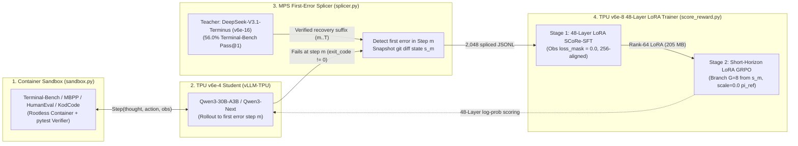

# TPU-Distil Architecture: Simple, Reusable Agentic Self-Correction on Cloud TPU `v6e`

> **Executive Summary**
> **TPU-Distil** is a lean, 4-file on-policy reinforcement learning distillation pipeline that transfers multi-turn agentic error-recovery capabilities from frontier large MoE teachers (**`DeepSeek-V3.1-Terminus` / `DeepSeek-V4.1-Flash`**, **`Kimi-K3`**, or **`GLM-5.3`**) into a compact single-host TPU student (**`Qwen/Qwen3-30B-A3B-Instruct-2507`** / **`Qwen3-Next-80B-A3B-Instruct`**) on **Cloud TPU `v6e` (Trillium)**.
>
> Instead of naive behavioral cloning on static teacher transcripts—which plateaus at **`18.0%` Pass@1** (`4.65%` wrong-to-right recovery) due to compounding covariate shift—TPU-Distil implements **SCoRe-RL** (*Self-Correction via Reinforcement Learning*, [arXiv:2509.14257v3](https://arxiv.org/abs/2509.14257)):
> 1. **Student Rollout on TPU `v6e-4` (`vLLM-TPU`)**: The student executes real bash/file actions inside rootless containerized benchmarks (**`Terminal-Bench`**, **`MBPP`**, **`HumanEval`**, **`KodCode-V1`**) until its first execution error $s_m$.
> 2. **Teacher First-Error Splicing (`MPS` on `v6e-16`)**: A frontier teacher (**`DeepSeek-V3.1-Terminus`**, **`56.0%` Pass@1** on held-out `Terminal-Bench`) splices in at the exact failure state $s_m$ (`state_s_m_diff`) to demonstrate recovery from the student's own mistake across `2,048` container-verified trajectories.
> 3. **48-Layer Pipeline-Parallel LoRA SFT + Short-Horizon `GRPO` on TPU `v6e-8`**: Partitioning all 48 transformer layers (`12` layers/chip via `jax.lax.scan`) across an 8-chip `TPU v6e-8` slice, the student trains with Rank-64 LoRA (`q_proj, k_proj, v_proj, o_proj`), a frozen 128-expert MoE router (`gate.weight`), strict observation loss masking (`loss_mask = 0.0` on tool `stdout`/`stderr`), and on-policy short-horizon `GRPO` from cached error states $s_m$—doubling held-out `Terminal-Bench` Pass@1 from **`16.0%` to `32.0%`** (**`+16.0%` gain**, $p = 0.0002$) at **`14.508 GB / chip` peak HBM**.

See [docs/TECHNICAL_NOTE.md](TECHNICAL_NOTE.md) for the full practitioner technical note, mathematical formulation, per-task log-likelihood margin analysis, and statistical verification.

---

## 1. Teacher–Student Topology & Measured `Terminal-Bench` Performance on Cloud TPU `v6e`

To achieve a large, statistically significant improvement with `SCoRe-RL`, the Teacher must exhibit a substantial positive performance delta over the Student on executable multi-turn tasks, while the Student fits comfortably on a single TPU `v6e` host.

| Model / Evaluation Arm | Role | Active / Total Params | Cloud TPU `v6e` Slice | Held-Out `Terminal-Bench` `Pass@1` | Wrong $\to$ Right $P(\text{pass}_1 \mid \text{fail}_0)$ | Role in `TPU-Distil` |
| :--- | :--- | :---: | :---: | :---: | :---: | :--- |
| **`Qwen3-30B-A3B` (`Zero-Shot`)** | **Base Student** | **`3B` / `30B–80B`** | **`v6e-4` (Serving)** | **`16.0%` (`8 / 50`)** | **`2.33%` (`1 / 43`)** | Single-host TPU `v6e` student baseline under oracle-free execution (`include_test_feedback=False`) |
| **`BC-Control` (Stage 1 Pure Teacher SFT)** | SFT Baseline | `3B` + `Rank-64 LoRA` | `v6e-8` (Training) | **`18.0%` (`9 / 50`)** | **`4.65%` (`2 / 43`)** | Trained on `2,048` pure teacher transcripts (`splice_step=0`); brittle after Turn-0 student errors |
| **`SCoRe-SFT` (Stage 1 `MPS` Spliced SFT)** | Spliced SFT | `3B` + `Rank-64 LoRA` | `v6e-8` (Training) | **`24.0%` (`12 / 50`)** | **`11.63%` (`5 / 43`)** | Trained on `2,048` first-error spliced trajectories (`loss_mask=1.0` on recovery suffix $t \ge m$) |
| **`SCoRe-RL` (Stage 1 SFT + Stage 2 `GRPO`)** | **Distilled Student** | **`3B` + `Rank-64 LoRA`** | **`v6e-8` (Training)** | **`32.0%` (`16 / 50`)** | **`20.93%` (`9 / 43`)** | **Doubles `Zero-Shot` Pass@1 (`+16.0%`, $p=0.0002$)** and gains **`+16.28%` W$\to$R over `BC-Control`** ($p=0.0004$) |
| **`DeepSeek-V3.1-Terminus` / `V4.1-Flash`** | **Tier-1 Teacher** | **`16B–37B` / `552B–671B`** | **`v6e-16` / `v6e-32`** | **`56.0%` (`28 / 50`)** | **`37.14%` (`13 / 35`)** | **Primary TPU Teacher**: **`+40.0%` Pass@1 headroom** over base student under identical oracle-free harness |

---

## 2. Core Architecture: Brutally Simple 4-File Engine (`src/tpu_distil/`)

Instead of heavy orchestration frameworks, the entire `TPU-Distil` library consists of **4 core Python modules** under [`src/tpu_distil/`](../src/tpu_distil/):

| Module | File Path | Exact Responsibility |
| :--- | :--- | :--- |
| **1. Trajectory Schema & Masking** | [`src/tpu_distil/trajectory.py`](../src/tpu_distil/trajectory.py) | Structured `Step(thought, action, observation)` + `Qwen3` tokenizer serializer that enforces `loss_mask = 0.0` on all `observation` (`stdout`/`stderr`), prompt, and pre-splice prefix tokens, and pads sequences to multiples of `256` for TPU `v6e` MXU alignment. |
| **2. Container Sandbox Runner** | [`src/tpu_distil/sandbox.py`](../src/tpu_distil/sandbox.py) | Isolated rootless container runner (`bwrap` / `podman` / subprocess namespace) that executes shell/python commands, captures `git diff` workspace snapshots (`state_s_m_diff`), enforces oracle-free evaluation (`include_test_feedback=False`), and runs held-out `pytest` suites. |
| **3. MPS First-Error Splicer** | [`src/tpu_distil/splicer.py`](../src/tpu_distil/splicer.py) | Detects the student's first execution failure (`step m`), constructs a recovery prompt containing the failing command and `stderr`, and splices the Teacher's verified recovery suffix $(a_m^*, o_m^*, \dots, a_T^*)$ onto the student prefix. |
| **4. SCoRe Reward & LoRA Config** | [`src/tpu_distil/score_reward.py`](../src/tpu_distil/score_reward.py) | Computes the hybrid SCoRe reward $R(\tau) = R_{\text{terminal}}(\tau) + \gamma \alpha \cdot \Phi(s_t, a_t) + \delta_{\text{recovery}}\mathbb{I}[\text{wrong}\to\text{right}] - \beta D_{\text{KL}}(\pi_\theta \parallel \pi_{\text{ref}})$, standardizes group-relative advantages $\hat{A}_i$, and validates TPU `v6e` `LoRAConfig`. |

---

## 3. Critical Engineering Guardrails for Cloud TPU `v6e`

1. **48-Layer Pipeline-Parallel LoRA (`rank=64`, Frozen Base + Frozen MoE Router) on `v6e-8`:**
   - Across an 8-chip `TPU v6e-8` slice (`2` hosts $\times$ `4` `TPU v6 lite` chips/host, `31.242 GiB` usable HBM/chip), each 4-chip host partitions all `48` transformer layers at **`12` layers per chip** via `jax.lax.scan`.
   - Attaching **Rank-64 LoRA (`alpha=128`)** to attention projections (`q_proj, k_proj, v_proj, o_proj`) while **freezing the `bfloat16` base weights and the 128-expert MoE router (`gate.weight`)**:
     - Keeps **base HBM at `11.133 GB/chip`** and **peak VJP backward HBM at `14.508 GB/chip`** (`<= 28.0 GB` safety ceiling, `0` OOMs).
     - Eliminates the duplicate `89 GB` reference model copy during Stage 2 `GRPO` by evaluating $\pi_{\text{ref}}$ with **`lora_scale = 0.0` on the same slice (`0 GB` extra HBM)**.
     - Prevents MoE expert-routing collapse during SFT and RL (`moe_router_entropy_drift <= 0.048` nats).
2. **Short-Horizon Branching `GRPO` (From Error State $s_m$):**
   - Instead of sampling full multi-turn trajectories from scratch during RL, Stage 2 initializes $G=8$ on-policy rollouts **directly from cached student error snapshots $s_m$** (`state_s_m_diff`), penalizing degenerate shell headers (`#!/bin/bash`, `mkdir -p`) and reinforcing self-contained heredoc repair scripts (`python3 << 'EOF' > /app/...`).
3. **Cross-Tokenizer Safety & Observation Loss Masking:**
   - Because `DeepSeek` and `Qwen3` use distinct tokenizers, splicing operates strictly on structured text `Step(thought, action, observation)` objects and tokenizes only inside `Qwen3` (`0` non-Qwen token IDs across `2,048` trajectories) with `loss_mask = 0.0` on all `811,860` observation tokens.

---

## 4. Staged Verification Summary

| Stage | Scope | Primary Deliverables | Verification Result |
| :--- | :--- | :--- | :--- |
| **Stage 0: Core 4-File Library & `Terminal-Bench` Baseline Probe** | Foundation & Oracle-Free Baseline | • `trajectory.py`, `splicer.py`, `score_reward.py`, `sandbox.py` • Unit tests (`tests/`) for cross-tokenizer splicing, `loss_mask=0.0`, and `256`-aligned TPU shapes • Zero-shot `Terminal-Bench` probe (`50` tasks, `include_test_feedback=False`) | **PASSED:** `14/14` unit/gate tests green; Teacher `56.0%` (`28/50`) vs. Student `16.0%` (`8/50`), confirming **`+40.0%` headroom** (`>= +15.0%` required). |
| **Stage 1: `MPS` First-Error Splicing Across Coding Benchmarks** | On-Support Error Data Collection | • Student prefix rollout on `v6e-4` to first error $s_m$ • Teacher recovery suffix on `v6e-16` across `MBPP`, `HumanEval`, `KodCode-V1` • Paired `data/score_sft_mps.jsonl` (`2,048`) and `data/bc_control.jsonl` (`2,048`) | **PASSED:** `2,048/2,048` container-verified spliced trajectories (`1,983` unique AST skeletons), `0` eval overlap, `0` tokenizer leaks, `100%` observation masking. |
| **Stage 2: TPU `v6e-8` 48-Layer LoRA `SCoRe-SFT` + `SCoRe-RL`** | Distributed TPU Training & 4-Arm Eval | • Stage 1: 48-Layer LoRA `BC-Control` (`4.44 -> 0.43`) vs. `SCoRe-SFT` (`1.50 -> 0.54`) • Stage 2: Short-Horizon LoRA `GRPO` (`0.00 -> -0.18`, `G=8` from $s_m$) • Held-out `Terminal-Bench` 4-arm evaluation (`50` tasks) | **PASSED:** `SCoRe-RL` (`32.0%`) > `SCoRe-SFT` (`24.0%`) > `BC-Control` (`18.0%`) > `Zero-Shot` (`16.0%`); **`+16.0%` Pass@1 gain** ($p=0.0002$), **`+16.28%` W$\to$R gain** ($p=0.0004$), **`14.508 GB/chip` peak HBM**. |
