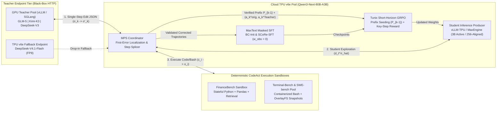

# TPU-Distil: Architecture & Technical Design Document

**Status:** Draft for Review | **Target Hardware:** Cloud TPU `v6e` / `v7x` (Student) + GPU / TPU Fallback (Teacher)  
**Primary Student:** `Qwen3-Next-80B-A3B` (`MaxText` + `Tunix` + `vLLM-TPU`)  
**Candidate Teachers:** `GLM-5`, `Kimi-K3`, `DeepSeek-V3` (GPU) / `DeepSeek-V4.1-Flash` (TPU `v6e` Fallback)

---

## 1. Executive Summary & Strategic Thesis

Enterprise and developer workloads have shifted from single-turn Q&A to **long-horizon agentic execution** (`10–30` turns of tool use, code execution, and terminal interaction across `8K–32K` context lengths). While frontier models (`GLM-5`, `Kimi-K3`, `DeepSeek-V3`, `Claude Sonnet`) achieve high solve rates on benchmarks such as `Terminal-Bench`, `SWE-bench`, and `FinanceBench`, serving or RL-tuning them at scale ties up scarce multi-node GPU clusters.

At the same time, traditional distillation approaches fail in agentic regimes:
- **Static Q&A / Off-Policy Trajectory SFT (Behavior Cloning):** Suffers from **quadratic compounding error ($O(H^2 \varepsilon)$)** over horizon $H$. A single student misstep produces an out-of-distribution tool observation that the teacher never encountered, causing the trajectory to spiral.
- **Token-Level Logit / On-Policy Distillation (OPD):** Requires the teacher and student to share an identical vocabulary/tokenizer and demands co-locating massive teacher weights alongside the student during every RL step.

**`TPU-Distil`** solves both bottlenecks by combining **Student-Centered One-step Reinforcement (`SCoRe-RL`, [arXiv:2509.14257v3](https://arxiv.org/html/2509.14257v3))** with a **TPU-aligned ultra-sparse student architecture (`Qwen3-Next-80B-A3B`)** on **MaxText** and **Tunix**.

### The Three Operational Levers

| Operational Lever | Mechanism | System & Business Impact |
|---|---|---|
| **1. Hardware-Architecture Alignment (`v6e` / `v7x`)** | `Qwen3-Next-80B-A3B` activates only **3B parameters/token** with 3:1 hybrid **Gated DeltaNet (linear attention)** and hidden dimensions aligned to the **256 $\times$ 256 MXU systolic array**. | $>10\times$ higher rollout throughput at `16K–32K` agent contexts and near-4$\times$ lower KV-cache HBM footprint vs dense 32B/70B models. |
| **2. Asymmetric Rollout Economics (`10:1` TPU Offload)** | The TPU `v6e` student generates $100\%$ of exploratory and RL group rollouts ($G=16$). The GPU teacher is only invoked to inspect failed trajectories and output a **single-step JSON correction** ($\sigma_k \to \sigma'_k$, $\sim 1\text{K}$ tokens). | $>90\%$ of total distillation token volume executes on high-efficiency TPU `v6e` slices rather than GPU nodes. |
| **3. Cross-Hardware Decoupling ("Free Up Your GPUs")** | SCoRe exchanges structured `[Thought, Action, Observation]` steps over HTTP rather than token logits. Any non-Qwen GPU teacher can mentor `Qwen3-Next-80B-A3B` without tokenizer lock-in. | Frees 8-GPU (`H100`/`H200`) clusters immediately after trajectory collection while `MaxText` and `Tunix` run SFT and RL on TPU. |

---

## 2. End-to-End System Architecture

---

## 3. Core Technical Concepts & Algorithmic Design

### 3.1 Cross-Tokenizer Structured Step Splicing (`Step` AST vs Token Splicing)
Because non-Qwen teachers (`GLM-5`, `Kimi-K3`, `DeepSeek-V3`) and `Qwen3-Next-80B-A3B` use incompatible tokenizers and chat delimiters, splicing raw token IDs corrupts sequence boundaries.
- **Design:** Trajectories are represented as sequences of structured `Step(thought, action, observation)` objects ($\sigma_i = (t_i, c_i, o_i)$) using **executable code (`CodeAct`)** as the universal action space.
- When the teacher corrects step $k$, it returns structured JSON `(correction_start_step: k, corrected_thought: t'_k, corrected_action: c'_k)`.
- The sandbox executes $c'_k$ to produce deterministic observation $o'_k$. The spliced prefix $(\sigma_1, \dots, \sigma_{k-1}, \sigma'_k)$ is assembled at the `Step` AST level and rendered into `Qwen3-Next` token IDs strictly inside the TPU student boundary.

### 3.2 Mentored Problem-Solving (`MPS`) & Implicit Verification
Instead of training on off-policy teacher rollouts $d_t^{\pi_E}$, the `BC-Init` student explores tasks under its own state distribution $d_t^{\hat{\pi}}$:
1. **Earliest-Error Intervention:** When a student trajectory $\tau_S = (\sigma_1, \dots, \sigma_H)$ fails verification, the teacher reviews the global trace and replaces **only the first critical mistake** $\sigma_k \to \sigma'_k$.
2. **Student Continuation:** The student resumes rollout from $(\sigma_1, \dots, \sigma_{k-1}, \sigma'_k)$. Up to $M=5$ single-step interventions are permitted per task.
3. **Implicit Verification Filter:** A teacher edit $\sigma'_k$ is retained for SFT **if and only if** the student subsequently completes the task and passes ground-truth verification. This filters out noisy teacher suggestions automatically and reduces the compounding error bound from $\mathcal{O}(H^2 \varepsilon)$ to $\mathcal{O}(H \varepsilon)$ (Theorem 4.2).
4. **Dual Supervision Yield:** Each validated trajectory provides (a) a capability-matched trajectory for **`SCoRe-SFT`**, and (b) a verified prefix $P_{k-1} = (\sigma_1, \dots, \sigma_{k-1})$ plus contrastive action pair $(a_k^{\text{orig}}, a_k^{\pi_E})$ for **`SCoRe-RL`**. Tasks unsolved after 5 interventions are retained ($10\%$ mix) as `Hard-to-Teach` RL exploration prompts.

### 3.3 Observation Loss Masking ($w_{\text{obs}} = 0.0$)
Agent trajectories contain large volumes of tool stdout/stderr (`observation_i`). Computing cross-entropy loss on environment outputs wastes gradient capacity and causes the student to hallucinate fake observations during inference.
- **Design:** All `MaxText` / `Tunix` SFT data loaders enforce `loss_mask = 1.0` strictly on assistant `Thought` and `Action` spans and `loss_mask = 0.0` on system prompts, user queries, padding, and environment `Observation` spans.

### 3.4 Short-Horizon Prefix Seeding & Critic-Free Key-Step `GRPO` (`Tunix`)
Full-horizon RL from $t=1$ suffers from high policy gradient variance $\text{Var}[g_1] \le \mathcal{O}\left(\frac{(1-\gamma^H)^4}{(1-\gamma)^4}\right)$ and sparse binary rewards when all rollouts in a group fail.
- **Short-Horizon Prefix Seeding:** `Tunix` initializes all $G=16$ group rollouts directly from the verified prefix $P_{k-1} = (\sigma_1, \dots, \sigma_{k-1})$ (`action_mask = 0.0` on $P_{k-1}$), shrinking the active horizon to $H' = H - k + 1$, cutting rollout token volume by $\ge 30\%$, and monotonically tightening gradient variance (Theorem 4.3).
- **4-Tier Composite Key-Step Reward:** Each rollout completion $\tau'$ starting at step $k$ is scored without an 80B critic network using group-normalized advantages over:
  $$R(\tau') = \begin{cases} 1.0 \ (R_{\text{final}}) & \text{if final task answer passes ground-truth verification} \\ 0.5 \ (R_{\text{key}}) & \text{if final answer fails, but step } k \text{ is functionally equivalent to teacher fix } a_k^{\pi_E} \\ 0.1 \ (R_{\text{format}}) & \text{if final answer fails, step } k \text{ is valid CodeAct, and } a_k \neq a_k^{\text{orig}} \\ 0.0 & \text{if step } k \text{ repeats student error } a_k^{\text{orig}} \text{ or violates format} \end{cases}$$
  Even when $0/16$ rollouts solve a hard task end-to-end, rollouts that reproduce the teacher's step-$k$ state transition earn $+0.5$, preserving non-zero group advantage variance $\text{std}(R_1, \dots, R_G) > 0$.

### 3.5 Hardware Co-Design: TPU `v6e` 256-Dim Alignment & Stateful Container Replay
1. **256-Aligned Bucket Packing (`MaxText` & `Tunix`):** Variable-length trajectories and prefixes $P_{k-1}$ are bucket-padded to $\{2048, 4096, 8192, 16384, 32768\}$ (exact multiples of the `256x256` TPU `v6e` MXU systolic array), preventing XLA JIT recompilation and maximizing MXU utilization.
2. **Stateful Container Prefix Snapshots (`Terminal-Bench` & `SWE-bench`):** Because bash commands mutate filesystem state, `TerminalBenchSandbox` replays $(c_1, \dots, c_{k-1})$ once to create a Copy-on-Write (`OverlayFS`) snapshot $S_{k-1}^{\text{snap}}$. All $G=16$ parallel `Tunix` GRPO rollouts fork from $S_{k-1}^{\text{snap}}$ in `<50ms`, and `R_key` equivalence is verified deterministically via `exit_code == 0` plus `git diff` / stdout equivalence.

---

## 4. Key Architectural Decisions & Trade-Offs

| Area | Decision | Alternatives Considered | Rationale |
|---|---|---|---|
| **Student Model** | **`Qwen3-Next-80B-A3B`** on TPU `v6e` from Phase 0 | Dense `Qwen3-8B` / `32B` or `Gemma-3-27B` | Only **3B active params/token** + 3:1 Gated DeltaNet linear attention + 256-aligned MXU dimensions; first-class `MaxText` & `Tunix` distillation/RL support. |
| **Teacher Model** | **Non-Qwen GPU Teacher** (`GLM-5`, `Kimi-K3`, `DeepSeek-V3`) + **`DeepSeek-V4.1-Flash` TPU Fallback** | Same-family `Qwen3-235B` only | Proves cross-architecture, cross-tokenizer distillation ("GPU Teacher $\to$ TPU Student") and avoids blocking on GPU availability via the TPU `v6e` fallback. |
| **Distillation Algorithm** | **SCoRe (`BC-Init` $\to$ `MPS` $\to$ `SCoRe-SFT` $\to$ `SCoRe-RL`)** | Static Q&A SFT, Full-Trajectory BC, or Token-Level KL OPD | Eliminates $O(H^2)$ covariate shift, requires zero cross-accelerator logit shipping, and allows the student to surpass teacher trajectories via RL exploration. |
| **Benchmark Sequence** | **`FinanceBench` (MVP)** $\to$ **`Terminal-Bench` & `SWE-bench` (Scale)** | Starting with Dockerized `SWE-bench` on Day 1 | `FinanceBench` runs in `<100ms`/step in a local Python `CodeAct` sandbox, validating the `MPS` + `Tunix` GRPO loop in hours before adding 15s container rollouts. |

---

## 5. Phased Implementation Roadmap & Acceptance Gates

> **Governance Rule:** Progression across phases is strictly gated. A subsequent phase cannot begin until **100% of the Acceptance Criteria and Pass Gate clauses** (including negative controls) for the current phase are verified `GREEN`. Hyperparameters and context bucket targets are re-baselined between phases using empirical measurements from the completed phase.

| Phase | Scope & Deliverables | Summarized Acceptance Criteria & Pass Gate | Negative Control Requirement |
|---|---|---|---|
| **Phase 0: Core Harness & Schema Foundation** | Cross-tokenizer `Step` splicer, `256`-aligned `w_obs=0.0` SFT packer, `FinanceBench` Python `CodeAct` sandbox, and 4-tier `SCoRe-RL` reward engine. | **Gate 0:** 100% unit/integration suite pass; all SFT tensors satisfy `len % 256 == 0` and `loss_mask[obs] == 0.0`; stateful Python sandbox enforces per-step timeouts. | Repeating original student error $a_k^{\text{orig}}$ or malformed syntax strictly yields `R_key = 0.0` and `R_format = 0.0`. |
| **Phase 1: Live `MPS` Trajectory & Prefix Collection** | Connect `Qwen3-Next-80B-A3B` (`vLLM-TPU` on `v6e`) + non-Qwen teacher (`GLM-5` / `Kimi-K3` / `DeepSeek-V3`); run `BC-Init` (20%) and `MPS` single-step correction (80%) on `FinanceBench`. | **Gate 1:** Single-step teacher edits ($\sigma_k \to \sigma'_k$) recover **$\ge 25\%$** of failed student trajectories within $\le 5$ interventions at $<2,000$ teacher tokens/edit; exports validated 50/50 `SCoRe-SFT` & `SCoRe-RL` splits. | Uncorrected student resampling from prefix $P_{k-1}$ (without teacher edit $\sigma'_k$) recovers $\ge 10\%$ fewer tasks than `MPS`. |
| **Phase 2: TPU `v6e` `SCoRe-SFT` & Short-Horizon `SCoRe-RL` MVP** | Run `MaxText` `SCoRe-SFT` and `Tunix` Short-Horizon `GRPO` ($G=16$ from $P_{k-1}$) on `Qwen3-Next-80B-A3B` on TPU `v6e`; run 4-arm evaluation on held-out `FinanceBench`. | **Gate 2:** `Student-SCoRe-RL` achieves **$\ge +10\%$ absolute accuracy gain** over `Student-ZeroShot`, beats `Student-BC-Control` and `Student-SCoRe-SFT`, and cuts rollout tokens by **$\ge 30\%$** vs full-horizon GRPO with zero MoE routing collapse. | `SCoRe-RL` ablation run with `R_key = 0.0` underperforms full `SCoRe-RL` (`R_key = 0.5`) on held-out evaluation. |
| **Phase 3: `Terminal-Bench` / `SWE-bench` Scale & Showcase** | Integrate containerized bash/pytest `CodeAct` sandbox with `OverlayFS` prefix replay ($S_{k-1}^{\text{snap}}$) and `git diff` step equivalence; scale `Qwen3-Next-80B-A3B` to `16K–32K` buckets on `v6e`. | **Gate 3:** `Student-SCoRe-RL` improves held-out `Terminal-Bench` solve rate by **$\ge +10\%$ absolute** over `Student-ZeroShot` on TPU `v6e` and publishes the 4-arm accuracy + TPU vs GPU cost/throughput report. | Resuming step $k$ in a fresh container without `checkout_prefix(P_{k-1})` fails stateful verification, proving snapshot replay integrity. |

---

## 6. Four-Arm Head-to-Head Evaluation Contract

Every milestone report benchmarks four models on identical held-out tasks and TPU `v6e` hardware slices:

1. **`Student-ZeroShot`**: Base `Qwen3-Next-80B-A3B` on TPU `v6e` (pre-distillation floor).
2. **`Student-BC-Control`**: `Qwen3-Next-80B-A3B` trained via standard full-trajectory Behavior Cloning (traditional distillation baseline).
3. **`Student-SCoRe-SFT`**: `Qwen3-Next-80B-A3B` fine-tuned on `MPS` first-error-corrected trajectories.
4. **`Student-SCoRe-RL`**: Full `SCoRe-SFT` + `Tunix` Short-Horizon Key-Step GRPO.

**Reported Metrics:** Task Solve Rate / Pass@1 (`%`), Relative Gain over `ZeroShot` and `BC-Control`, TPU `v6e` Inference Throughput (`tokens/sec/chip` at `4K`, `16K`, `32K`), Rollout Token Savings (`%`), and GPU Cluster Hours Saved.
