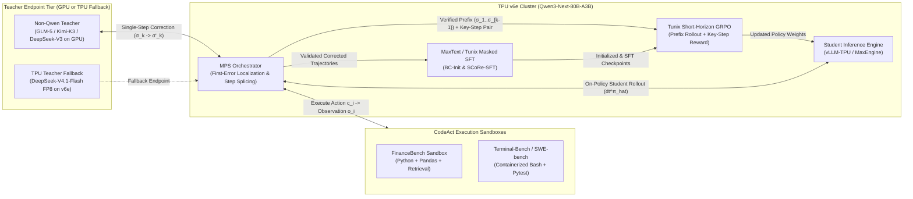

# TPU-Distil Architecture & Technical Design

## 1. Problem Statement & Operational Levers

Large agentic language models achieve high solve rates on multi-step benchmarks (`Terminal-Bench`, `SWE-bench`, `FinanceBench`), but incur prohibitive inference cost and tie up scarce GPU clusters across dozens of reasoning-action-observation turns. Conversely, naive behavior cloning (Q&A or full-trajectory SFT) onto smaller student models suffers from $O(H^2 \varepsilon)$ compounding covariate shift when the student deviates from the teacher's trajectory distribution.

`TPU-Distil` combines three operational levers to close the agentic intelligence gap while shifting agent rollout and training compute onto Cloud TPUs (`v6e` / `v7x`):

1. **TPU Systolic Array Alignment (`Qwen3-Next-80B-A3B`)**:
   - Cloud TPU `v6e` (Trillium) and `v7x` feature a **256-dimension MXU systolic array**. Architectures whose hidden and projection dimensions align as multiples of 256 achieve peak MXU utilization.
   - `Qwen3-Next-80B-A3B` combines 80B total parameters with **only 3B active parameters per token** and a 3:1 hybrid Gated DeltaNet (linear attention) + Gated Attention layout, delivering $>10\times$ inference throughput at $32\text{K}+$ context lengths in **MaxText** and **vLLM-TPU**.
2. **Asymmetric Rollout Economics via Student-Centered Distillation (`SCoRe`)**:
   - Student trajectory generation runs entirely on TPU `v6e`, enabling $10\times$ higher rollout volume per dollar and larger batch sizes.
   - The GPU-hosted teacher (`GLM-5`, `Kimi-K3`, or `DeepSeek-V3`) is never queried for dense token logits or full trajectory re-generations during on-policy training. Instead, the teacher inspects failed student trajectories globally and emits a single JSON correction ($\sim 800\text{--}1200$ tokens) pinpointing and fixing only the **earliest critical error step** ($\sigma_k \to \sigma'_k$).
3. **Cross-Accelerator Decoupling ("Free Up Your GPUs")**:
   - Because teacher supervision is strictly text/JSON over an OpenAI-compatible HTTP endpoint, the teacher can run on a temporary GPU slice (`8xH100/H200` via vLLM/SGLang) or a TPU fallback (`DeepSeek-V4.1-Flash` / `DeepSeek-V3` FP8 on `v6e`). Once Mentored Problem-Solving (`MPS`) trajectories are collected, the GPU node is freed while **MaxText** and **Tunix** execute `SCoRe-SFT` and `SCoRe-RL` natively on TPU `v6e`.

---

## 2. System Architecture



---

## 3. Three-Stage Training Pipeline (`SCoRe`)

### Stage 1: Cold-Start Behavior Cloning (`BC-Init`)

To bootstrap valid multi-turn tool formatting (`[Thought, Action, Observation]`) and accommodate cross-family tokenization (non-Qwen teacher $\to$ `Qwen3-Next-80B-A3B` student):
- **Data Generation**: On $20\%$ of seed tasks, the teacher generates a high-level `<first_thought>` plan followed by iterative `(thought_i, action_i, observation_i)` triplets. Only trajectories passing final ground-truth verification are retained (rejection sampling).
- **Template Normalization**: A canonical template adapter maps teacher thoughts and `CodeAct` blocks into `Qwen3-Next` chat/tool delimiters.
- **Observation-Masked SFT**: MaxText/Tunix trains `Qwen3-Next-80B-A3B` minimizing cross-entropy loss **exclusively on assistant `Thought` and `Action` tokens**, masking all environment `Observation` tokens ($w_{\text{obs}} = 0$).

### Stage 2: Mentored Problem-Solving (`MPS`) & `SCoRe-SFT`

Using the `BC-Init` policy $\hat{\pi}_{\text{init}}$ as an active explorer on the remaining $80\%$ of tasks:
1. **Student Exploration**: $\hat{\pi}_{\text{init}}$ rolls out a full trajectory $\tau_S = (\sigma_1, \dots, \sigma_H)$ on TPU `v6e`, where $\sigma_i = (t_i, c_i, o_i)$.
2. **First-Error Localization**: If $\tau_S$ fails verification, the teacher inspects $\tau_S$ and outputs structured JSON:
   ```json
   {
     "is_correct": false,
     "error_analysis": "...",
     "correction_start_step": k,
     "corrected_thought": "...",
     "corrected_action": "..."
   }
   ```
3. **Step Splicing & Continuation**: Action $\sigma_k$ is replaced with $\sigma'_k = (t'_k, c'_k, o'_k)$, and the **student** resumes generation from prefix $(\sigma_1, \dots, \sigma_{k-1}, \sigma'_k)$. Up to $M=5$ single-step interventions are permitted per task.
4. **Implicit Verification & Split**:
   - If the student reaches a verified correct answer, the spliced trajectory is retained (reducing covariate shift error bound from $O(H^2 \varepsilon)$ to $O(H \varepsilon)$).
   - Validated trajectories are split 50/50 between **`SCoRe-SFT`** (continued observation-masked SFT in MaxText) and **`SCoRe-RL`** (storing verified prefix $P_{k-1} = (\sigma_1, \dots, \sigma_{k-1})$ and key-step pair $(a_k^{\text{orig}}, a_k^{\pi_E})$).
   - Tasks unsolved after 5 interventions are tagged `Hard-to-Teach`; $10\%$ are mixed into `SCoRe-RL` for unconstrained exploration.

### Stage 3: Short-Horizon Key-Step RL (`SCoRe-RL` on Tunix)

Standard full-horizon GRPO suffers from high gradient variance $\mathcal{O}\left(\frac{C}{(1-\gamma)^4}\right)$ and sparse binary rewards. `SCoRe-RL` modifies Tunix GRPO in two ways:
1. **Prefix-Conditioned Short-Horizon Rollouts**:
   - Instead of rolling out from $t=1$, Tunix initializes $G=16$ group rollouts directly from the verified prefix $P_{k-1} = (\sigma_1, \dots, \sigma_{k-1})$, shortening the active rollout horizon to $H' = H - k + 1$ and bounding gradient estimator variance monotonically with $k$.
2. **Composite Key-Step Reward**:
   For each rollout completion $\tau'$ starting at step $k$ with generated step-$k$ action $a_k$:
   $$R(\tau') = \begin{cases} R_{\text{final}} \ (= 1.0) & \text{if final task answer is verified correct} \\ R_{\text{key}} \ (= 0.5) & \text{if final answer fails, but } \text{Equiv}(a_k, a_k^{\pi_E}) = \text{True} \\ R_{\text{format}} \ (= 0.1) & \text{if final answer fails, } a_k \text{ is valid CodeAct, and } a_k \neq a_k^{\text{orig}} \\ 0.0 & \text{otherwise} \end{cases}$$
   where $\text{Equiv}(a_k, a_k^{\pi_E})$ evaluates execution output equivalence (or lightweight semantic verifier equivalence) at step $k$.

---

## 4. Evaluation & Head-to-Head Telemetry Contract

Every benchmark evaluation compares four arms on identical held-out splits and hardware slices:
1. **`Student-ZeroShot`**: Base `Qwen3-Next-80B-A3B` on TPU `v6e`.
2. **`Student-BC-Control`**: `Qwen3-Next-80B-A3B` fine-tuned only on full teacher trajectories (standard distillation baseline).
3. **`Student-SCoRe-SFT`**: `Qwen3-Next-80B-A3B` trained with MPS first-error-corrected trajectories.
4. **`Student-SCoRe-RL`**: Full `SCoRe-SFT` + Tunix Short-Horizon Key-Step GRPO.

Metrics recorded per arm:
- Task accuracy / pass@1 (`FinanceBench` F1 & numerical EM; `Terminal-Bench` / `SWE-bench` container test pass rate), targeting **$\ge +10\%$ absolute improvement** over `Student-ZeroShot`.
- TPU `v6e` throughput (tokens/sec/chip) and effective cost per 1,000 trajectories vs GPU teacher baseline.
