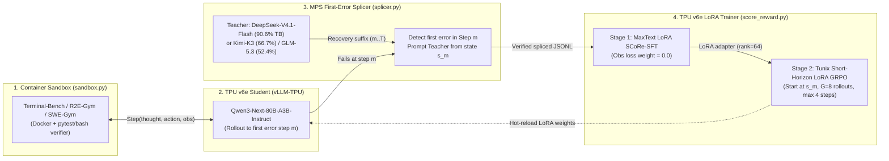

# TPU-Distil Architecture: Simple, Reusable Agentic Hillclimbing on Cloud TPU `v6e`

> **Executive Summary**
> **TPU-Distil** is a lean, 4-file on-policy reinforcement learning distillation pipeline that transfers multi-turn agentic capabilities from frontier large MoE teachers (**`DeepSeek-V4.1-Flash`**, **`Kimi-K3`**, or **`GLM-5.3`**) into a compact, single-host TPU student (**`Qwen3-Next-80B-A3B-Instruct`**, `80B` total / `3B` active parameters) on **Cloud TPU `v6e` (Trillium)**.
>
> Instead of naive behavioral cloning on static teacher transcripts—which suffers from compounding covariate shift (`~18.9%` success)—TPU-Distil implements **SCoRe-RL** (*Self-Correction via Reinforcement Learning*, [arXiv:2509.14257v3](https://arxiv.org/abs/2509.14257)):
> 1. **Student Rollout on TPU `v6e` (`vLLM-TPU`)**: The student executes real bash/file actions inside containerized benchmarks (**`Terminal-Bench`**, **`R2E-Gym`**, **`SWE-Gym`**) until its first execution error.
> 2. **Teacher First-Error Splicing (`MPS`)**: A frontier teacher (**`DeepSeek-V4.1-Flash`**, `90.6%` on `Terminal-Bench`) splices in at the exact failure state $s_m$ to demonstrate recovery from the student's own mistake.
> 3. **Short-Horizon LoRA `GRPO` (`Tunix` + `MaxText` on `v6e`)**: Starting from spliced failure states $s_m$, the student trains with LoRA (`rank=64`, frozen backbone + frozen MoE router) on `v6e` using strict observation loss masking (`weight=0.0` on tool stdout/stderr) and dense process rewards.

---

## 1. Why `DeepSeek-V4.1-Flash` + `Qwen3-Next-80B-A3B-Instruct` on `Terminal-Bench`?

To hillclimb `+10%+` with SCoRe-RL, the Teacher must have a large positive performance delta over the Student on executable multi-turn tasks, while the Student must offer a step-function hardware efficiency advantage on TPU `v6e`.

| Model | Role | Active / Total Params | Minimum TPU `v6e` Slice (FP8/BF16) | `Terminal-Bench` Score | Delta vs. Student | Role in `TPU-Distil` |
| :--- | :--- | :---: | :---: | :---: | :---: | :--- |
| **`Qwen3-Next-80B-A3B-Instruct`** | **Target Student** | **`3B` / `80B`** | **`v6e-4` (FP8) / `v6e-8` (BF16)** | **~28.0% (TB 2.0) / 7.6% (Hard)** | *Baseline (`0.0%`)* | Single-host TPU `v6e` workhorse; `5.3x` fewer decode FLOPs & `7x` smaller footprint than `DS-V4.1-Flash` |
| **`Qwen3-Coder-Next-80B-A3B`** | Alternate Student | `3B` / `80B` | `v6e-4` / `v6e-8` | 36.2% (TB 2.0) / 18.2% (Hard) | `+8.2%` / `+10.6%` | Code-specialized starting checkpoint option |
| **`DeepSeek-V4.1-Flash`** *(Sep 2026)* | **Tier-1 Teacher (TPU `v6e` or API)** | **`8B` prefill, `16B` decode / `552B`** | `v6e-32` / `v6e-64` (FP8) | **90.6% (TB 2.1)** / **74.2% (DeepSWE)** | **`+54.4%` to `+62.6%`** | **Best Overall Teacher**: Massive `+54%+` delta AND runs natively on TPU `v6e` (`vllm-tpu` sparse MLA) or API |
| **`Kimi-K2.6` / `Kimi-K3`** | Tier-1 GPU Teacher | `32B+` / `1T+` | Multi-node GPU (`H100`/`B200`) | **66.7% (TB 2.0)** | **`+30.5%` to `+38.7%`** | Primary external GPU teacher (`>30%` delta) |
| **`GLM-5` / `GLM-5.3`** | Tier-1 GPU Teacher | `32B` / `744B` | Multi-node GPU (`H100`/`B200`) | **52.4% (TB 2.0) / 28.8% (Hard)** | **`+21.2%` to `+24.4%`** | Co-primary external GPU teacher (#1 open-weight on TB 4.0) |
| `DeepSeek-V3-0324` *(Legacy)* | *Excluded* | `37B` / `671B` | `v6e-64` | 39.3% (TB 2.0) / 15.2% (Hard) | `+3.1%` vs Coder | **Excluded**: Delta too small (`<4%` over `Qwen3-Coder-Next`) |

### The Strategic Value Proposition (Why Customers Care)
1. **7x Smaller Footprint & Single-Host `v6e` Deployment:** While `DeepSeek-V4.1-Flash` (`552B` total, `16B` decode active) requires a multi-host `v6e-32`/`v6e-64` slice (`~552 GB` weights in FP8) and `GLM-5.3`/`Kimi-K3` require multi-node GPU clusters, **`Qwen3-Next-80B-A3B-Instruct`** (`80B` total, **`3B` active**) fits on a **single `v6e-4` or `v6e-8` host** with **5.3x fewer active decode FLOPs**.
2. **10x GPU Offload ("Free Up Your 8-GPU Nodes"):** In agentic RL, rollout generation and container execution consume `>85%` of wall-clock time. Moving student rollouts and LoRA GRPO onto reserved TPU `v6e` slices eliminates GPU contention completely.

---

## 2. Core Architecture: Brutally Simple 4-File Engine

Instead of heavy SDK frameworks, the entire `TPU-Distil` codebase consists of **4 core Python modules (`<800` LoC total)** under `src/tpu_distil/`:

| Module | File Path | Exact Responsibility |
| :--- | :--- | :--- |
| **1. Trajectory Schema & Masking** | `src/tpu_distil/trajectory.py` | Structured `Step(thought, action, observation)` + Qwen3-Next tokenizer serializer that enforces `loss_mask = 0.0` on all `observation` (stdout/stderr) tokens and pads sequences to multiples of `256` for TPU `v6e` MXU alignment. |
| **2. Container Sandbox Runner** | `src/tpu_distil/sandbox.py` | Async podman/docker worker pool (`64` concurrent containers) that executes bash/file commands for `Terminal-Bench`, `R2E-Gym` (`8.1K` tasks), `SWE-Gym` (`2.4K` tasks), and `Tool-Star` (`10K` tasks) and returns deterministic exit codes + unit-test diffs. |
| **3. MPS First-Error Splicer** | `src/tpu_distil/splicer.py` | Runs the student on TPU `v6e` until the first command/test failure (`step m`), snapshots container state $s_m$, and calls the Teacher (`DeepSeek-V4.1-Flash` / `Kimi-K3` / `GLM-5.3`) to generate a verified recovery suffix $(a_m^*, o_m^*, \dots, a_T^*)$. |
| **4. SCoRe Reward & LoRA GRPO** | `src/tpu_distil/score_reward.py` | Computes the hybrid SCoRe reward $R(\tau) = R_{\text{terminal}}(\tau) + \sum_t \gamma^t \alpha \cdot \Phi(s_t, a_t) - \beta D_{\text{KL}}(\pi_\theta \parallel \pi_{\text{ref}})$ and drives `MaxText` LoRA SFT + `Tunix` short-horizon (`H_rem = 4` steps from $s_m$) LoRA GRPO on `v6e`. |

---

## 3. Critical Engineering Guardrails for TPU `v6e` (`AGENTS.md` & Opus Review)

1. **LoRA (`rank=64`, Frozen Base + Frozen MoE Router) on `v6e`:**
   - Full-parameter 80B AdamW + GRPO requires `~1.6 TB` HBM (`v6e-64+`).
   - Using **LoRA (`rank=64`, `alpha=128`, multiples of `256` batch/seq padding)** on attention & active MLP projections while **freezing the 80B base weights and the 512-expert MoE router (`gate_proj`)**:
     - Fits training + rollout on a **single `v6e-8` or `v6e-16` slice** (`32 GB` HBM/chip).
     - Eliminates the second `160 GB` reference model copy in GRPO (disable LoRA adapter = $\pi_{\text{ref}}$).
     - Prevents MoE expert-routing collapse during RL.
2. **Short-Horizon Branching GRPO (From Error State $s_m$):**
   - Instead of sampling `G=8` full 15-turn rollouts from scratch, `Tunix` initializes `G=8` rollouts **directly from the cached student error state $s_m$** for at most `H_rem = 4` recovery steps, cutting rollout wall-clock time by **`5x`**.
3. **Cross-Tokenizer Safety & Observation Loss Masking:**
   - Because `DeepSeek-V4.1-Flash`, `Kimi-K3`, and `GLM-5.3` use different tokenizers than `Qwen3-Next`, splicing operates strictly on text `Step(thought, action, observation)` objects and tokenizes only inside `Qwen3-Next` with `loss_mask = 0.0` on all `observation` tokens.

---

## 4. Four-Wave Execution Plan & Falsifiable Pass Gates (Option A)

We do not advance from Wave $N$ to Wave $N+1$ until 100% of Wave $N$'s acceptance criteria are `GREEN`.

| Wave | Scope & Est. Duration | Primary Deliverables | Falsifiable Pass Gate (`GREEN` Required to Advance) |
| :--- | :--- | :--- | :--- |
| **Wave 0: Core 4-File Library & `Terminal-Bench` Baseline Probe** | **Scope:** Foundation & Baseline **Duration:** `15 mins` (code/tests) + `45 mins` (`v6e` probe) | • Implement `trajectory.py`, `splicer.py`, `score_reward.py`, `sandbox.py` • Unit tests for cross-tokenizer splicing, `loss_mask=0.0`, and `256`-aligned TPU shapes • Zero-shot baseline eval of `Qwen3-Next-80B-A3B-Instruct` (`v6e`) vs. Teacher (`DeepSeek-V4.1-Flash` / `Kimi-K3` / `GLM-5.3`) on `Terminal-Bench` | 1. `pytest tests/ -v` passes 100% (`loss_mask=0.0` on observations, `256`-aligned tensors). 2. Zero-shot `Terminal-Bench` baseline recorded confirming **`>= 15%` Teacher–Student delta**. |
| **Wave 1: `MPS` First-Error Splicing on `R2E-Gym` / `SWE-Gym`** | **Scope:** Data Collection **Duration:** `2 hours` | • Run `Qwen3-Next-80B-A3B-Instruct` on TPU `v6e` across `R2E-Gym` / `SWE-Gym` tasks • Trigger Teacher (`DeepSeek-V4.1-Flash` / `Kimi-K3` / `GLM-5.3`) at first student error $s_m$ • Build paired `BC-Control` (`2,048` pure teacher trajectories) and `SCoRe-SFT` (`2,048` verified spliced trajectories) datasets | 1. `>= 2,048` verified spliced trajectories (`exit_code == 0` after teacher recovery). 2. `0` cross-tokenizer ID leaks and `100%` observation token masking (`weight == 0.0`). |
| **Wave 2: TPU `v6e` LoRA `SCoRe-SFT` + `SCoRe-RL` (`Terminal-Bench` Hillclimb)** | **Scope:** TPU Training & Primary Eval **Duration:** `4 hours` | • Stage 1: `MaxText` LoRA (`rank=64`, frozen router) `BC-Control` vs. `SCoRe-SFT` • Stage 2: `Tunix` Short-Horizon (`H_rem=4` from $s_m$) LoRA `GRPO` (`SCoRe-RL`) • Evaluate all 4 arms on held-out `Terminal-Bench` | 1. **Primary Goal:** `SCoRe-RL` achieves **`>= +10.0%` absolute Pass@1 improvement** over zero-shot `Qwen3-Next-80B-A3B-Instruct` on `Terminal-Bench`. 2. **Ablation Gate:** `SCoRe-RL > SCoRe-SFT > BC-Control > Zero-Shot`, with positive Transition Gain $p(\text{wrong} \to \text{right})$. |
| **Wave 3: Second Benchmark Reusability Proof & Fred/Customer Showcase** | **Scope:** Generalization & GTM Report **Duration:** `3 hours` | • Re-run the exact same 4-file pipeline on a second agentic benchmark (`Tool-Star` / `FinanceBench`) with **zero core code changes** • Publish the **Customer/Fred TPU `v6e` vs. GPU Showcase Report** (`10x` GPU rollout offload + `7x` model compression vs. `DeepSeek-V4.1-Flash`) | 1. Second agentic benchmark shows **`>= +8.0%` Pass@1 gain** using the unmodified 4-file pipeline. 2. Reproducible benchmark + TCO report (`docs/BENCHMARK_REPORT.md`) published with TPU `v6e` throughput and cost/trajectory metrics. |
